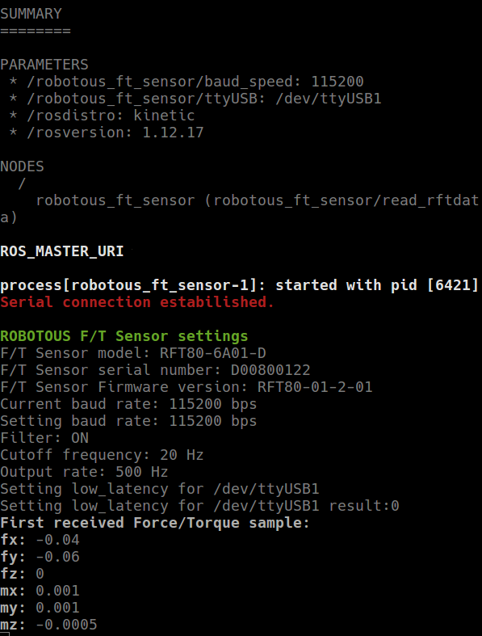

# Robotous FT Sensor Node for ROS
 Robotous FT Sensor ROS Node


# Requirements
- Ubuntu 16.04
- ROS Kinetic

# 1. Install and Build Source Code
```bash
$ cd ~/catkin_ws/src
$ git clone https://github.com/Neoplanetz/robotous_ft_sensor_ros.git
$ cd ..
$ catkin_make
```

# 2. Check USB Serial COM port Number
```bash
# display ttyUSB Information
$ dmesg | grep ttyUSB

[    4.315205] usb 1-14.4.1: FTDI USB Serial Device converter now attached to ttyUSB0
[ 5258.061657] ftdi_sio ttyUSB0: usb_serial_generic_read_bulk_callback - urb stopped: -32
[ 5258.276486] ftdi_sio ttyUSB0: error from flowcontrol urb
[ 5258.276692] ftdi_sio ttyUSB0: FTDI USB Serial Device converter now disconnected from ttyUSB0
[602026.998168] usb 1-14.4.1: FTDI USB Serial Device converter now attached to ttyUSB1

# attached ttyUSB Number is ttyUSB*
# check buad speed ttyUSB
$ sudo stty -F /dev/ttyUSB*

speed 115200 baud; line = 0;
min = 1; time = 0;
-brkint -imaxbel
-opost -onlcr
-isig -icanon -iexten -echo -echoe -echok -echoctl
-echoke
```

# 3. Set User Permission and Reboot
```bash
$ sudo usermod -a -G dialout $USER
$ sudo usermod -a -G tty $USER
$ reboot
```

# 4. Install SetSerial
```bash
$ sudo apt install setserial
```

# 5. set ttyUSB Name and baud in Robotous FT Sensor Launch file
- usb_name : "/dev/ttyUSB*"
- baud : 115200

# 6. Execute Robotous FT Sensor ROS Node
```bash
$ roscore
$ roslaunch robotous_ft_sensor robotous_ft_sensor.launch
```



# 7. Display Force and Torque values of Robotous FT Sensor
```bash
$ rqt
```

- Add Plot (RQt -> Plugin -> Visualization -> Plot)
- Force  Topic : /robotous_ft_sensor/rft_data/wrench/force
- Torque Topic : /robotous_ft_sensor/rft_data/wrench/torque


